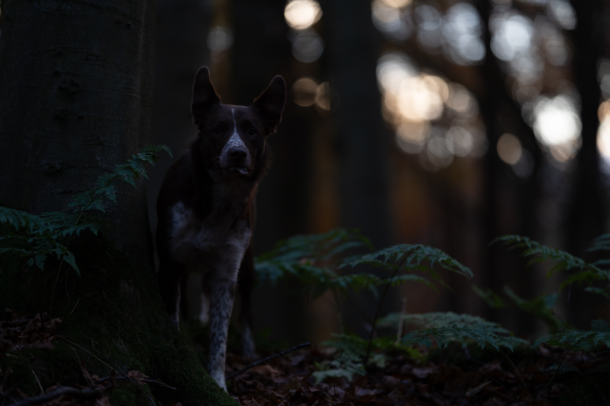

# CVL_Assignment01: Image Enhancement

## Methodology

I applied two different **Pixel-based gray-level transforms** to correct the images. These methods operate directly on individual pixel intensity values to create a new, enhanced image.

### 1. Linear Transformation (For the Dark Image)
To correct the dark image, I used a Linear Transformation method with Python and the OpenCV library. This improvement relies on the following mathematical formula:

$$g(x)=\alpha \cdot f(x)+\beta$$

* $f(x)$ represents the original pixel value.
* $g(x)$ represents the new, improved pixel value.
* **$\alpha$ (Alpha = 1.3):** This controls the contrast. Multiplying the pixels by a number larger than 1.0 increases the contrast, making the difference between the light and dark areas more noticeable.
* **$\beta$ (Beta = 30):** This controls the brightness. Adding a positive number increases the overall brightness, bringing out details from the dark areas.

I used the `cv2.convertScaleAbs()` function in OpenCV to apply this formula. This function is highly useful because it automatically keeps the final pixel values within the standard 0 to 255 range, which prevents visual errors in the final picture.

### 2. Power-Law / Gamma Transformation (For the Bright Image)
To fix the overly bright image, I applied a Power-Law Transformation. This method is based on the following mathematical formula:

$$s=c \cdot r^\gamma$$

* $r$ represents the original pixel value.
* $s$ represents the new, improved pixel value.
* **$c$ (Constant = 1.0):** This is a simple scaling factor.
* **$\gamma$ (Gamma = 2.5):** This controls the intensity curve. Using a value greater than 1.0 compresses the brighter pixels and expands the darker ones, successfully darkening the washed-out image and recovering lost details.

I implemented this by creating a Look-Up Table (LUT) in NumPy and applying it with the `cv2.LUT()` function. This maps every original pixel to its new calculated value efficiently.

## Results

Below are the comparisons between the original photos and the improved results after applying the respective mathematical transformations:

### Part 1: Dark Image Enhancement
 

### Part 2: Bright Image Enhancement

